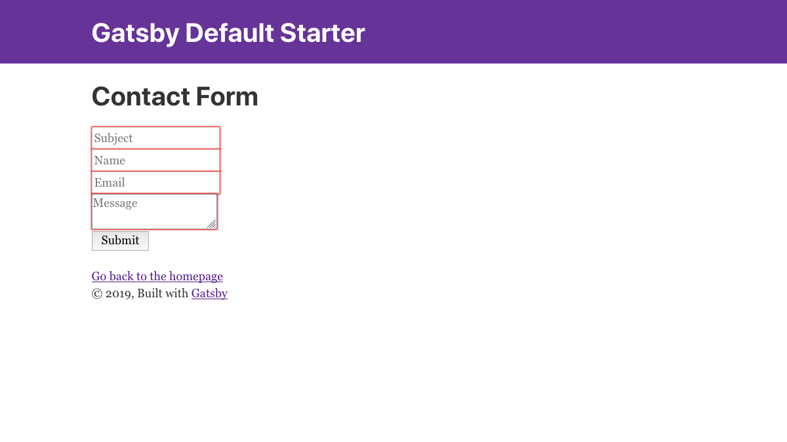

# Example of how to build a Contact Form for GatsbyJS with Firebase Database as backend

Contact Form, made with [GatsbyJS](https://www.gatsbyjs.org/), using a [Firebase Realtime Database](https://www.gatsbyjs.org/) integration as backend to store data.



## 🚀 Quick start

1.  **Start developing**

    Navigate into the project directory and start it up.

    ```sh
    gatsby develop
    ```

1.  **Open the source code and start editing**

    Your site is now running at `http://localhost:8000`!

1.  **Firebase config**  

    To make it work you must add your Firebase Database credentials and config to **`src/utils/firebase.js`**:

    ```javascript
      const config = {
        apiKey: "XXXXXXXXXXXXXXXXXXXXXX",
        authDomain: "XXX.firebaseapp.com",
        databaseURL: "https://XXX.firebaseio.com",
        projectId: "XXX",
        storageBucket: "XXX.appspot.com",
        messagingSenderId: "XXXXXXXXXXXX",
        appId: "X:XXXXXXXXXX:XXX:XXXXXXXXXX"
      };
    ```

    then navigate to `http://localhost:8000/contact` to see the Contact Form in action.
